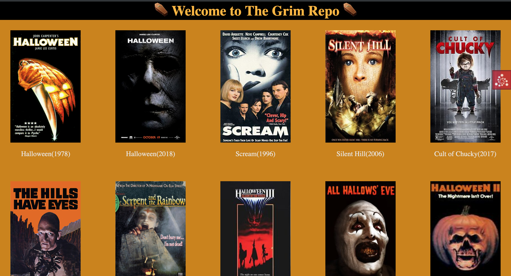

# Welcome to the Grim Repo

This is a small project I started developing so i can keep track of the horror movies I've been 
binge watching. Originally a static website with Pyramid, I decided I wanted to add movies
the easy way, with a gui, and not by adding a new div with the movie info. 

Right now, the project and webpage look alike and hopefully i'll keep on working on
the project instead of the static site. 

## This is how the page looks like right now:

<!--  -->

## Run the project

To run, follow the lengthy instructions in this [gist](https://gist.github.com/afrotonder/3756473ad6a5a2c770d5804c824e1fb2) i wrote up.
